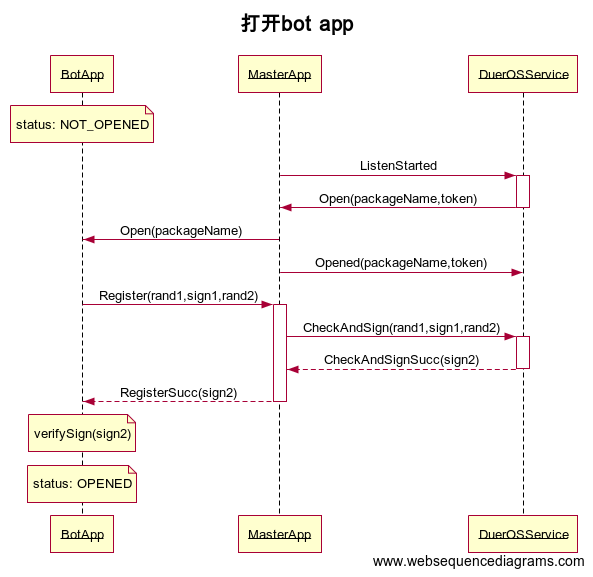
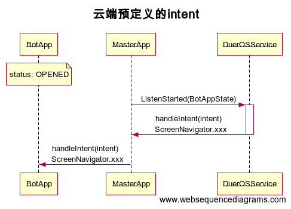
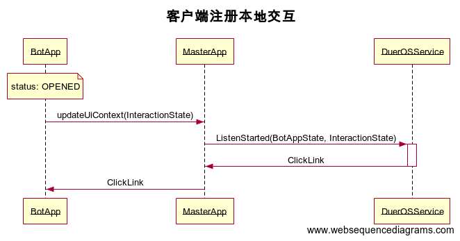
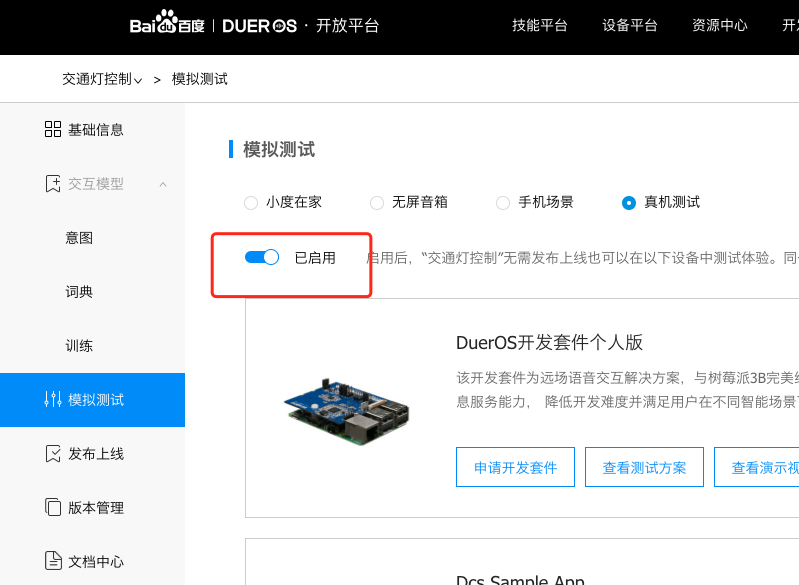

## 需求背景

有些情况下 ，开发者需要```以客户端app的型式，实现一个bot```，包括但不限于以下情况：

  * app（可能是电视、手机、pad上的）已经存在，需要和dcs语音交互的主控程序去打通
  * bot的功能，需要在端上有比较复杂的界面、交互、功能实现（只用view + tts 的简单交互满足不了）

所以，需要实现一个安卓系统的sdk，辅助开发以安卓app形式存在的bot。

开发出来的app可以用在在电视、show等基于安卓的DuerOS设备上


```android bot sdk```的基本功能：

* 被调起
* 被探测
* 接收语音解析出来的指令
* 主动上报ui状态（供语音解析使用）
* 在适当的时候发起语音请求


## DBP平台上的前期准备

* 申请成为DuerOS开发者
  * [https://dueros.baidu.com/dbp/](https://dueros.baidu.com/dbp/) 
  * [https://dueros.baidu.com/dbp/bot/index#/authorization](https://dueros.baidu.com/dbp/bot/index#/authorization)
  * 激活码``AndroidAPP``
* 在DBP上创建技能，类型是Android App
  * packageName
  * key
  * [调用名称]


## 流程图

### 流程1: 打开bot app





### 流程2: 云端定义的intent

可以在dbp平台上定义intent，也可以是云端预定义的ScreenNavigator等指令




### 流程3: 客户端custom\_user\_interaction




## API

### BotSdk的初始化

建议在application启动的时候完成BotSdk的初始化
```
BotSdk.getInstance().init(application);
```


### 注册过程

如果启动后不能正确注册，将无法收到解析出来的指令

```java

public void register(){
    if (!BotSdk.getInstance().isRegister()) {
        String rand1="hongyang"+Math.random();
        String rand2= "yanghong"+Math.random();
        String botId="3fcc17e3-7e97-b9ec-84cd-5211f6271394"; //来自DBP平台
        BotSdk.getInstance().register(
            messageListener,
            botId,
            rand1,
            sign(rand1),
            rand2,
            sign(rand2)
        );
    }
}

public String sign(String rand){
    String key = "abcdefghijk12345";  //来自DBP平台
    return getMD5(rand+key);
}

```


### 响应云端请求

onHandleIntent 响应DBP平台上定义的intent。onHandleScreenNavigatorEvent响应内置的屏幕导航请求

```java
new IBotMessageListener() {
    @Override
    public void onHandleIntent(String token, BotIdentity identity, BotIntent intent,
                               String customData) {
        Log.d("BotSdk", "onHandleIntent:" + token + "|" + identity
                .accessToken + "|" + intent.name + "|" + intent.slots + "|" +
                customData);

        if ("light_on".equals(intent.name )) {
            if (intent.slots!=null  && intent.slots.size() > 0 && intent.slots.get(0).value.equals("黄灯")) {
                mLight.setImageDrawable(getResources().getDrawable(R.drawable.light2));
            } else {
                mLight.setImageDrawable(getResources().getDrawable(R.drawable.light3));
            }
        } else if ("light_off".equals(intent.name)) {
            mLight.setImageDrawable(getResources().getDrawable(R.drawable.light));
        }

    }


    //内置的屏幕导航请求
    @Override
    public void onHandleScreenNavigatorEvent(int event) {

        String msg = "";

        switch (event) {
            case IBotMessageListener.NAV_SCROLL_LEFT: //“向左滚动”
                msg = "NAV_SCROLL_LEFT";
                break;
            case IBotMessageListener.NAV_SCROLL_RIGHT: //“向右滚动”
                msg = "NAV_SCROLL_RIGHT";
                break;
            case IBotMessageListener.NAV_SCROLL_UP: //“向上滚动”
                msg = "NAV_SCROLL_UP";
                break;
            case IBotMessageListener.NAV_SCROLL_DOWN: //“向下滚动”
                msg = "NAV_SCROLL_DOWN";
                break;
            case IBotMessageListener.NAV_NEXT_PAGE: //“下一页”
                msg = "NAV_NEXT_PAGE";
                break;
            case IBotMessageListener.NAV_PREVIOUS_PAGE: //“上一页”
                msg = "NAV_PREVIOUS_PAGE";
                break;
            case IBotMessageListener.NAV_GO_HOMEPAGE: //“回到首页”
                msg = "NAV_GO_HOMEPAGE";
                break;
            case IBotMessageListener.NAV_GO_BACK: //“返回”
                msg = "NAV_GO_BACK";
                break;
            default:
                break;
        }
        Toast.makeText(MainActivity.this, msg, Toast.LENGTH_SHORT).show();
    }

};
```


### 客户端自定义交互


```java

//定义自定义交互
private void updateUiContext() {
    UiContextPayload payload = new UiContextPayload();
    HashMap<String, String> params;
    
    params = new HashMap<>();
    params.put("name", "地址");
    params.put("type", "city");
    payload.addHyperUtterance(
            "sdkdemo://input",  //url
            null,  //words，自定义的query列表
            "input", //type
            params);  //其他参数

    String[] words = {"试一试", "点击试一试"};
    params = new HashMap<>();
    params.put("name", "试一试");
    payload.addHyperUtterance("sdkdemo://clicktest",
            words,
            "link",
            params);

    BotSdk.getInstance().updateUiContext(payload);
}


//响应自定义交互
new IBotMessageListener() {
    @Override
    public void onClickLink(String url, HashMap<String, String> paramMap) {
        Log.d(TAG, "onClickLink: " + url + " , " + paramMap);
        if("sdkdemo://clicktest".equals(url)){
            findViewById(R.id.test).performClick();
        }

        if("sdkdemo://input".equals(url)){
            ((TextView)findViewById(R.id.input)).setText(paramMap.get("content"));
        }

        Toast.makeText(MainActivity.this, "url = " + url, Toast.LENGTH_SHORT).show();
    }
}
```


#### 自定义交互支持的type列表


<table style="border-collapse: collapse; min-width: 100%;">
    <colgroup>
        <col style="width: 130px;" />
        <col style="width: 129px;" />
        <col style="width: 77px;" />
        <col style="width: 294px;" />
        <col style="width: 264px;" />
    </colgroup>
    <tbody>
        <tr>
            <td style="background-color: rgb(234, 234, 234); border: 1px solid rgb(187, 187, 187); width: 130px; padding: 8px;">
                <div>type</div></td>
            <td style="background-color: rgb(234, 234, 234); border: 1px solid rgb(187, 187, 187); width: 129px; padding: 8px;">
                <div>request params</div></td>
            <td style="background-color: rgb(234, 234, 234); border: 1px solid rgb(187, 187, 187); width: 77px; padding: 8px;">
                <div>response slots</div>
                <div>（除了默认的url之外）</div></td>
            <td style="background-color: rgb(234, 234, 234); border: 1px solid rgb(187, 187, 187); width: 294px; padding: 8px;">example</td>
        </tr>
        <tr>
            <td>
                <div>input</div></td>
            <td>
                <div>name:</div>
                <div>(optional) value:</div>
                <div>(optional) type:</div>
                <div>&nbsp;&nbsp;date</div>
                <div>&nbsp;&nbsp;car_number</div>
                <div>&nbsp;&nbsp;cityxpress_number</div>
                <div>&nbsp; city<e>
                <div>(optional) prefix(暂不支持)</div>
                <div></div>
            </td>
            <td>content</td>
            <td>
                <div>“输入地址北京”</div>
                <div>request params</div>
                <div>{</div>
                <div>&nbsp;&nbsp;name:地址,</div>
                <div>&nbsp;&nbsp;type:city</div>
                <div>}</div>
                <div></div>
                <div>response params</div>
                <div>{</div>
                <div>&nbsp;&nbsp;content:北京</div>
                <div>}</div></td>
        </tr>
        <tr>
            <td>
                <div>button</div></td>
            <td>
                <div>name</div>
                <div>(optional) index</div>
                <div>(optional) index_x</div>
                <div>(optional) index_y</div></td>
            <td>
                <div>-</div></td>
            <td>
                <div>“点击确认”、“选择确认”、“选择第一个”</div>
                <div>request params</div>
                <div>{</div>
                <div>&nbsp;&nbsp;name: 确认,</div>
                <div>&nbsp;&nbsp;index: 1,</div>
                <div>}</div></td>
            </div>
        </tr>
        <tr>
            <td>
                <div>link</div></td>
            <td>
                <div>name</div>
                <div>(optional) index</div>
                <div>(optional) index_x</div>
                <div>(optional) index_y</div>
                <div>(optional) prefix(暂不支持)</div></td>
            <td>
                <div>-</div></td>
            <td>
                <div>“点击确认”、“选择确认”、“选择第一个”</div>
                <div>request params</div>
                <div>{</div>
                <div>&nbsp;&nbsp;name: 确认,</div>
                <div>&nbsp;&nbsp;index: 1,</div>
                <div>}</div></td>
        </tr>
        <tr>
            <td>
                <div>select</div></td>
            <td>
                <div>name</div>
                <div>(optional) selected</div>
                <div>(optional) index</div>
                <div>(optional) index_x</div>
                <div>(optional) index_y</div></td>
            <td>
                <div>-</div></td>
            <td>
                <div>“选择确认”、“选择第一个”</div>
                <div>request params</div>
                <div>{</div>
                <div>&nbsp;&nbsp;name: 确认,</div>
                <div>&nbsp;&nbsp;index: 1,</div>
                <div>}</div></td>
        </tr>
        <tr>
            <td>
                <div>video</div></td>
            <td>
                <div>name</div>
                <div>(optional) index</div>
                <div>(optional) index_x</div>
                <div>(optional) index_y</div>
                <div>(optional) actors(screen_e)</div>
                <div>(optional) director</div>
                <div>(optional) prefix(暂不支持)</div>
                <div>//后续增加的字段要与structures/search-video-structure-private.md 保持一致</div>
                </td>
            <td>
                <div>-</div></td>
            <td>
                <div>"播放琅琊榜"</div>
                <div>request params</div>
                <div>{</div>
                <div>&nbsp;&nbsp;name: 琅琊榜</div>
                <div>}</div></td>
        </tr>
        <tr>
            <td>
                <div>music</div></td>
            <td>
                <div>name</div>
                <div>(optional) index</div>
                <div>(optional) index_x</div>
                <div>(optional) index_y</div>
                <div>(optional) singers</div>
                <div>(optional) album</div>
                <div>(optional) prefix(暂不支持)</div></td>
            <td>
                <div>-</div></td>
            <td>
                <div>"播放青花瓷"</div>
                <div>request params</div>
                <div>{</div>
                <div>&nbsp;&nbsp;name: 青花瓷</div>
                <div>}</div></td>
        </tr>
        <tr>
            <td>
                <div>tab</div></td>
            <td>
                <div>name</div>
                <div>(optional) selected</div>
                <div>(optional) index</div>
                <div>(optional) index_x</div>
                <div>(optional) index_y</div>
                <div>(optional) prefix(暂不支持)</div></td>
            <td>
                <div>-</div></td>
            <td>
                <div>“切换到电视剧”</div>
                <div>request params</div>
                <div>{</div>
                <div>name: 电视剧</div>
                <div>}</div></td>
        </tr>
        <tr>
            <td>scroll</td>
            <td>
                <div>(optional) name:</div>
                <div>(optional) type:</div>
                <div>vertical</div>
                <div>horizontal</div>
                <div>page</div></td>
            <td>
                <div>direction 方向，取值{left/right/up/down}</div>
                <div></div>
                <div>by 滚动的相对值，可以有正负</div>
                <div></div>
                <div>to 滚动的绝对值，-1代表滚到底</div></td>
            <td>
                <div>"把电影列表向下滚动"</div>
                <div>request params</div>
                <div>{</div>
                <div>name:电影列表</div>
                <div>}</div>
                <div></div>
                <div>response params</div>
                <div>{</div>
                <div>direction:{left/right/up/down}</div>
                <div>&nbsp;&nbsp;by: {{LONG}},</div>
                <div>&nbsp;&nbsp;to: {{LONG}}, //to ==-1的时候，表示“滚到底”</div>
                <div>&nbsp;&nbsp;//by和to的单位，暂时都是 屏幕/页，以后有需求再加别的unit</div>
                <div>}</div></td>
        </tr>
        <tr>
            <td>pager</td>
            <td>
                <div>(optional) name:</div>
                <div>(optional) cur_page:</div>
                <div>(optional) min</div>
                <div>(optional) max</div>
                </td>
            <td>
                <div>by 页码的相对值，可以有正负</div>
                <div>to 页码的绝对值，-1代表最后一页(如果没有max的话, 才会返回-1;否则应该返回max-1)</div>
            </td>
            <td>
                <div>"把电影列表翻到最后一页"</div>
                <div>request params</div>
                <div>{</div>
                <div>&nbsp;&nbsp;name:电影列表</div>
                <div>}</div>
                <div></div>
                <div>response params</div>
                <div>{</div>
                <div>&nbsp;&nbsp;to: {{LONG}}, </div>
                <div>}</div></td>
        </tr>
         <tr>
            <td>step</td>
            <td>
                <div>(optional) name:</div>
                <div>(optional) cur_page:</div>
                <div>(optional) min</div>
                <div>(optional) max</div>
                </td>
            <td>
                <div>by 页码的相对值，可以有正负</div>
                <div>to 页码的绝对值，-1代表最后一页(如果没有max的话, 才会返回-1;否则应该返回max-1)</div>
            </td>
            <td>
                <div>"下一步"</div>
                <div>request params</div>
                <div>{</div>
                <div>}</div>
                <div></div>
                <div>response params</div>
                <div>{</div>
                <div>&nbsp;&nbsp;by: {{LONG}}, </div>
                <div>}</div></td>
        </tr>
        <tr>
            <td>call_phone</td>
            <td>
                <div>name</div>
                <div>(optional) index</div>
            </td>
            <td>
                <div>-</div>
            </td>
            <td>
                <div>"电话第一个"</div>
                <div>request params</div>
                <div>{</div>
                <div>index:1</div>
                <div>}</div>
                <div>response params</div>
                <div>{</div>
                <div>call_phone_type:(normal/voice/video)</div>
                <div>}</div></td>
        </tr>
        <tr>
            <td>send_message</td>
            <td>
                <div>name</div>
                <div>(optional) index</div>
            </td>
            <td>
                <div>-</div>
            </td>
            <td>
                <div>"发消息给第一个"</div>
                <div>request params</div>
                <div>{</div>
                <div>index:1</div>
                <div>}</div>
            </td>
        </tr>
        <tr>
            <td>read_message</td>
            <td>
                <div>(optional) index</div>
            </td>
            <td>
                <div>-</div>
            </td>
            <td>
                <div>"阅读第一条留言"</div>
                <div>request params</div>
                <div>{</div>
                <div>index:1</div>
                <div>}</div></td>
        </tr>
        <tr>
            <td>view_photo</td>
            <td>
                <div>(optional) index</div>
            </td>
            <td>
                <div>-</div>
            </td>
            <td>
                <div>"查看第一张照片"</div>
                <div>request params</div>
                <div>{</div>
                <div>index:1</div>
                <div>}</div></td>
        </tr>
        <tr>
            <td>
                <div></div>
            </td>
            <td>
                <div></div>
            </td>
            <td>
                <div></div>
            </td>
            <td>
                <div></div>
            </td>
        </tr>
    </tbody>
</table>

## 真机调试过程

完成开发的app，可以在小度设备上完成测试

* 在小度设备上安装开发完成的android app
* 在Dbp上打开真机调试

* “打开技能调试模式”，听完设置成功的tts不要打断
* “打开【调用名称】”，android app会被启动


## 新的安卓项目集成
在项目build.gradle中新增 maven库依赖
```gradle
maven{ url 'https://dueros.baidu.com/maven/repository/maven-releases/'}
```

在app/build.gradle加入依赖
```gradle
implementation 'com.baidu.duer.botsdk:bot-sdk-android:1.28.7@aar'
```
然后参考以上代码示例进行集成
